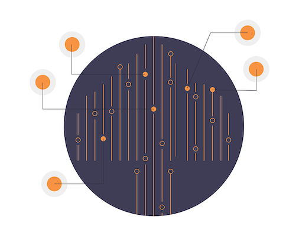

# <%= componentName %>

[![NPM Version][badge-npm-version]][url-npm]
[![Node Version][badge-node-version]][url-npm]
[![NPM Downloads][badge-npm-downloads]][url-npm]
![React Version][badge-react-version]
![Dependencies][badge-dependencies]
![License][badge-license]

[![NPM][image-npm]][url-npm]

<%= description %>

**中文 | [English](./README_EN.md)**

## 安装

### CDN 引入

可通过 [`unpkg`](https://unpkg.com/<%= name %>) 获取最新版本的资源，在页面中引入相应 `js` 和 `css` 文件即可。

``` html
<!-- 引入 YourComponent 组件 -->
<script src="https://unpkg.com/<%= name %>/dist/index.js"></script>

<!-- 引入 YourComponent 组件样式 -->
<link rel="stylesheet" href="https://unpkg.com/<%= name %>/dist/index.css">
```

### NPM 安装

``` bash
$ npm i -S <%= name %> # yarn add <%= name %>
```

## 概览



## 使用

一个简单的例子

``` jsx
import YourComponent from '<%= name %>'
import '<%= name %>/dist/index.css'

const options = [{
  value: '1',
  label: '一',
  children: [{
    value: '10',
    label: '十',
  }],
}, {
  value: '2',
  label: '二',
}]

const Demo = () => (
  <YourComponent options={options} />
)
```

详细使用方法可[查看文档](xxxxxx)或[查看示例源码](./examples)

<!-- ## 主题

提供三种主题，使用方法见[]()

### 默认


### 亮色


### 暗色

 -->

## 发布日志

详见 [Releases][url-releases]

<!-- ## Collaborators -->

## 开发和构建

[开发和构建](xxxxxx)

## 关于我们


[badge-npm-version]: https://img.shields.io/npm/v/<%= name %>
[badge-node-version]: https://img.shields.io/node/v/<%= name %>
[badge-npm-downloads]: https://img.shields.io/npm/dt/<%= name %>
[badge-license]: https://img.shields.io/npm/l/<%= name %>
[badge-dependencies]: https://img.shields.io/librariesio/release/npm/<%= name %>
[badge-react-version]: https://img.shields.io/npm/dependency-version/<%= name %>/peer/react

[url-npm]: https://npmjs.org/package/<%= name %>
[url-dependencies]: https://david-dm.org/vkbansal/<%= name %>
[url-releases]: https://github.com/xxxx/<%= name %>/releases

[image-npm]: https://nodei.co/npm/<%= name %>.png
